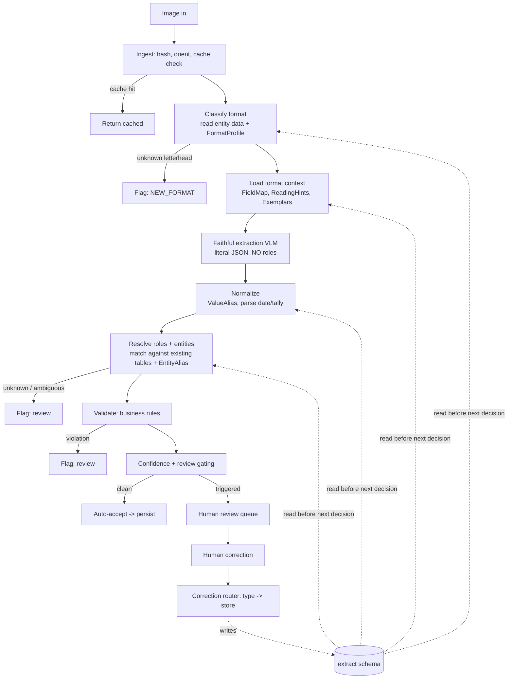
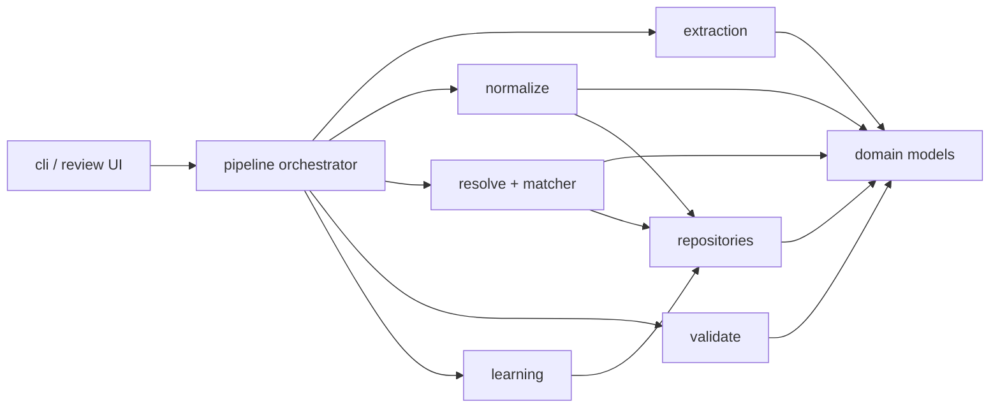

# Trucking Ticket Extraction — Implementation Spec (Claude Code Handoff)

> **What this is:** the complete, self-contained design + implementation plan for the handwritten-ticket extraction agent. This file is the single source of truth and **supersedes any earlier draft**.
>
> **For Claude Code:** read this entire document before writing code. The repo already contains the production app (**.NET + MS SQL Server**). Treat §3 (Design Principles) as hard constraints. Resolve the open items in §15 by **inspecting the codebase and asking the user** — do not guess table names, the app language, or the company-role model. Build order is §12; respect the anti-scope in §14.

---

## 1. Purpose

Extract structured data from photographed, handwritten trucking tickets that arrive in **many different layouts**. The same company can play different business roles on different tickets (a dispatcher on one, a direct customer on another), and that role is **not derivable from the image** — it is a fact stored in our database.

The system must:
1. Extract what is **literally on the ticket** (the model's only job).
2. Resolve **business roles and canonical values deterministically** from existing reference data.
3. **Learn from human corrections** by routing each correction to a typed store that is read *before* the next decision — no model retraining.

---

## 2. Problem statement & root-cause analysis

### 2.1 Evidence (three real sample tickets)

| Ticket | Issuer (letterhead) | "Customer" field | True role of issuer | Layout |
|---|---|---|---|---|
| #1261 | Wroom Logistics Inc. | BRE-EX (Kevin) | **Dispatcher** (brokered the load) | Customer/From/To/Material/Loads/Office table |
| #12818 | Lucy's Trucking Ltd. | Select Excavating | **Dispatcher** | Customer/From/To/Material/Loads/Office table |
| #1780 | Navacon Construction Inc. | Navacon Const. Inc. | **Customer** (hired the truck directly) | Header block + Delivery/Load Count/Total table |

All three are the same truck (52) and driver (Amrit Cheema). Whether the issuer is a dispatcher or a customer is **not visually reliable** — on #1/#2 the Customer field holds a third party; on #3 it repeats the issuer. A model trained to "know" these would memorize three names and fail on the fourth company it sees.

### 2.2 Two permanently separated concerns

- **Concern A — Faithful extraction (perception):** read handwriting, table structure, wrapped multi-line cells, tally-mark counts. Hard; improvable with prompt + (eventually) data.
- **Concern B — Resolution & normalization (business logic):** map issuer → role, resolve the job's customer, canonicalize materials/locations. Deterministic given reference data. **Not a model problem.**

The previous implementation failed because it solved B with the model and/or fed corrections back as one undifferentiated blob. We separate A and B permanently.

### 2.3 Corrections are *typed* (the core idea)

| Kind | Example | Store | Mechanism |
|---|---|---|---|
| **ROLE** | "Wroom is a dispatcher" | entity-role data | key→value fact |
| **ALIAS** | "'Kevin' means Bre-Ex" | `extract.EntityAlias` | learned lookup |
| **VALUE_ALIAS** | "'Cont. Soil' → 'Contaminated Soil'" | `extract.ValueAlias` | scoped lookup |
| **READING** | "Loads was 4, not 6" | `extract.Correction` → hint/exemplar on recurrence | few-shot / prompt hint |
| **FIELD_MAP** | "Navacon 'Total' is $, not load count" | `extract.FormatProfile.FieldMap` | per-format mapping |
| **NEW_FORMAT** | unrecognized letterhead | new `extract.FormatProfile` | template registration |

Each is read at a **different pipeline stage** (§9.2). Conflating them is the bug that broke the old system.

### 2.4 Why not RAG / embeddings for entity matching

The variation we see ("Bre-Ex" / "BREEX" / "Bre Ex" / "Kevin") is **lexical**, not semantic. Embeddings measure *meaning* similarity, which is the wrong axis and actively dangerous here: "Bre-Ex" and "Bree Excavating" embed *close* (both excavation firms) but are different legal entities — exactly the false-match-on-billing failure to avoid. Also: the corpus is dozens of entities (no retrieval-scale problem), embeddings are non-deterministic (breaks regression testing), and the hardest cases have **zero** similarity of any kind ("Kevin → Bre-Ex" is neither spelled like nor means anything like the target) — only a *learned alias* can resolve those. Use deterministic normalization + bounded fuzzy + learned aliases. See ADR-007.

---

## 3. Design principles (hard constraints)

1. **Don't overengineer.** Simple beats complex.
2. **No fallbacks.** One correct path; on an unmet precondition, **throw / flag for review** — never silently guess an alternative.
3. **One way.** Exactly one way to do each thing.
4. **Clarity over compatibility.** No shims bridging the old system.
5. **Throw errors.** Fail fast on precondition violations. (Note: a *no-match* from the entity resolver is an **expected outcome routed to review**, not an exception — see §8.5.)
6. **No backups.** The MS SQL database is the single source of truth; no shadow copies.
7. **Separation of concerns.** Each module one responsibility (extract / normalize / resolve / validate / learn never blend).
8. **Surgical changes; evidence-based debugging; fix root causes.** Targeted logging over defensive runtime checks; let the type system catch type errors.
9. **Files small, no god classes, zero circular deps, clear layer boundaries.**

> **Detective rule:** for any bug, state the *theory of the cause*, gather *evidence* (a log line, a failing golden case), and only then fix. No plausible-looking fixes without reproducing evidence.

---

## 4. Architecture overview

### 4.1 Pipeline



The dotted "read before next decision" arrows are the **learning loop**: every store is written by the correction router and read at the start of the relevant stage on the next run.

### 4.2 Layering (dependencies point inward)



`domain` depends on nothing. `store` depends only on `domain`. Stages depend on `domain` + `store`. `pipeline` wires stages. No stage imports another stage.

---

## 5. Stack & integration

- **Database: existing MS SQL Server.** The app already stores companies / dispatchers / customers. **Reuse those tables as the entity source of truth.** Do **not** build a parallel registry and do **not** modify the app's existing tables.
- **New tables live in a dedicated `extract` schema**, referencing existing entities by FK. This namespaces the agent and keeps app tables untouched (surgical).
- **Agent language:** the v1 pipeline has **no ML training** (deferred to Phase 5) and **no LangChain** (anti-scope). It is: *HTTP call to a VLM + deterministic logic + MS SQL reads/writes.* Nothing is Python-specific. **Recommendation: build the agent in the app's existing stack (.NET/C#)** — Dapper or EF Core to the same DB, `HttpClient` to the VLM. One stack, one deployment, shared types, no cross-language seam. *Claude Code: confirm the app language from the repo and build in it unless the user explicitly wants Python for learning purposes (in which case use `pyodbc`/`SQLAlchemy` and accept the seam).*
- **VLM** is reached over HTTP behind an interface (§8.3); the backend is a config choice (§11).
- **DeepSeek V4 has no role in the pipeline.** Role resolution is deterministic. The only legitimate place for a cheap text LLM is the **optional review-assist suggester** (§8.11) — it proposes matches for a human to confirm; it is never authoritative.

---

## 6. Data model

### 6.1 Reuse (already in MS SQL)
The existing company/dispatcher/customer table(s). **Claude Code must identify these and their PKs from the codebase**, and determine whether the dispatcher-vs-customer **role is already modeled** (a column, a type table, or separate tables). If role already exists, reuse it; if not, add `extract.EntityRole` (below).

### 6.2 New — `extract` schema (T-SQL)

> Replace `dbo.Company(CompanyId)` below with the **actual** entity table/PK confirmed from the codebase.

```sql
CREATE SCHEMA extract;
GO

-- Canonical form of each existing entity's real name (so we never alter app tables).
CREATE TABLE extract.EntityCanonical (
    CompanyId      INT NOT NULL
        CONSTRAINT FK_EntityCanonical_Company REFERENCES dbo.Company(CompanyId),
    CanonicalName  NVARCHAR(200) NOT NULL,
    CONSTRAINT PK_EntityCanonical PRIMARY KEY (CompanyId),
    CONSTRAINT UQ_EntityCanonical UNIQUE (CanonicalName)
);
GO

-- The "notebook": learned surface forms -> existing entity.
CREATE TABLE extract.EntityAlias (
    AliasId        INT IDENTITY(1,1) PRIMARY KEY,
    CompanyId      INT NOT NULL
        CONSTRAINT FK_EntityAlias_Company REFERENCES dbo.Company(CompanyId),
    CanonicalAlias NVARCHAR(200) NOT NULL,   -- normalized form, written by app code
    RawAlias       NVARCHAR(400) NOT NULL,   -- exactly as seen on the ticket
    Source         NVARCHAR(100) NULL,       -- correction id / 'seed' / 'human'
    CreatedAt      DATETIME2 NOT NULL CONSTRAINT DF_EntityAlias_CreatedAt DEFAULT SYSUTCDATETIME(),
    CONSTRAINT UQ_EntityAlias_Canonical UNIQUE (CanonicalAlias)
);
GO
CREATE INDEX IX_EntityAlias_CompanyId ON extract.EntityAlias(CompanyId);
GO

-- ONLY IF the app does not already model dispatcher vs customer.
CREATE TABLE extract.EntityRole (
    CompanyId  INT NOT NULL
        CONSTRAINT FK_EntityRole_Company REFERENCES dbo.Company(CompanyId),
    Role       VARCHAR(20) NOT NULL
        CONSTRAINT CK_EntityRole CHECK (Role IN ('dispatcher','customer','both','unknown')),
    CONSTRAINT PK_EntityRole PRIMARY KEY (CompanyId)
);
GO

-- Value normalization (materials, locations), optionally scoped to a format.
CREATE TABLE extract.ValueAlias (
    ValueAliasId   INT IDENTITY(1,1) PRIMARY KEY,
    FieldType      VARCHAR(40) NOT NULL,     -- 'material' | 'location' | ...
    RawValue       NVARCHAR(400) NOT NULL,
    CanonicalValue NVARCHAR(400) NOT NULL,
    FormatId       INT NULL,                 -- NULL = global
    Source         NVARCHAR(100) NULL,
    CONSTRAINT UQ_ValueAlias UNIQUE (FieldType, RawValue, FormatId)
);
GO

-- Per-format template knowledge.
CREATE TABLE extract.FormatProfile (
    FormatId         INT IDENTITY(1,1) PRIMARY KEY,
    IssuingCompanyId INT NOT NULL
        CONSTRAINT FK_FormatProfile_Company REFERENCES dbo.Company(CompanyId),
    TemplateName     NVARCHAR(120) NOT NULL,
    FieldMap         NVARCHAR(MAX) NOT NULL,   -- JSON: ticket column label -> canonical field
    ReadingHints     NVARCHAR(MAX) NOT NULL CONSTRAINT DF_FP_Hints DEFAULT '[]',
    Status           VARCHAR(20) NOT NULL CONSTRAINT DF_FP_Status DEFAULT 'active',
    CreatedAt        DATETIME2 NOT NULL CONSTRAINT DF_FP_Created DEFAULT SYSUTCDATETIME()
);
GO

CREATE TABLE extract.Exemplar (
    ExemplarId    INT IDENTITY(1,1) PRIMARY KEY,
    FormatId      INT NOT NULL REFERENCES extract.FormatProfile(FormatId),
    ImagePath     NVARCHAR(400) NOT NULL,
    FaithfulJson  NVARCHAR(MAX) NOT NULL,
    Note          NVARCHAR(400) NULL,
    Active        BIT NOT NULL CONSTRAINT DF_Ex_Active DEFAULT 1
);
GO

-- Every extraction; doubles as the cache (ImageHash UNIQUE).
CREATE TABLE extract.Extraction (
    ExtractionId   INT IDENTITY(1,1) PRIMARY KEY,
    ImageHash      CHAR(64) NOT NULL CONSTRAINT UQ_Extraction_Hash UNIQUE,
    ImagePath      NVARCHAR(400) NOT NULL,
    FormatId       INT NULL REFERENCES extract.FormatProfile(FormatId),
    RawJson        NVARCHAR(MAX) NULL,       -- faithful extraction
    NormalizedJson NVARCHAR(MAX) NULL,       -- after normalize + resolve
    Status         VARCHAR(20) NOT NULL,     -- 'auto_accepted'|'needs_review'|'corrected'
    Confidence     FLOAT NULL,
    CreatedAt      DATETIME2 NOT NULL CONSTRAINT DF_Extr_Created DEFAULT SYSUTCDATETIME()
);
GO

-- Append-only audit + future training data.
CREATE TABLE extract.Correction (
    CorrectionId  INT IDENTITY(1,1) PRIMARY KEY,
    ExtractionId  INT NULL REFERENCES extract.Extraction(ExtractionId),
    Type          VARCHAR(20) NOT NULL,     -- ROLE|ALIAS|VALUE_ALIAS|READING|FIELD_MAP|NEW_FORMAT
    FieldPath     NVARCHAR(200) NULL,
    FieldType     VARCHAR(40) NULL,
    EntityName    NVARCHAR(400) NULL,
    FormatId      INT NULL,
    FormatScope   INT NULL,
    BeforeValue   NVARCHAR(MAX) NULL,
    AfterValue    NVARCHAR(MAX) NULL,
    Author        NVARCHAR(120) NOT NULL,
    CreatedAt     DATETIME2 NOT NULL CONSTRAINT DF_Corr_Created DEFAULT SYSUTCDATETIME()
);
GO
```

Migrations are **forward-only** (clarity over compatibility). Use the team's existing migration tool (EF Core migrations / DbUp / Flyway — confirm from repo).

---

## 7. Domain contracts

> Shown as C# records (recommended stack). If building in Python, mirror with Pydantic models. The faithful model **cannot express a role by construction** — that is the point.

```csharp
// What the VLM is allowed to output. No roles. Optional fields by design.
public record CompanyBlock(string Name, string? Address, string? TicketNumber);

public record RawLineItem(
    string? Customer, string? FromLocation, string? ToLocation,
    string? Material, string? Loads,            // literal as written, e.g. "||||", "卌"
    string? Description, string? LoadCount,
    Dictionary<string,string> RawCells);

public record FaithfulTicket(
    CompanyBlock IssuingCompany,
    string? DateRaw, string? Driver, string? Truck,
    string? TimeIn, string? TimeOut, string? TotalHours,
    string? CustomerField,                       // literal value of any field labeled "Customer"
    IReadOnlyList<RawLineItem> LineItems);

// Produced by resolve + normalize.
public enum EntityRole { Dispatcher, Customer, Both, Unknown }
public record ResolvedEntity(int CompanyId, string CanonicalName, EntityRole Role);

public record NormalizedJob(
    string? Origin, string? Destination, string? Material,  // canonical
    int? LoadCount, double Confidence);                      // null LoadCount forces review

public record NormalizedTicket(
    ResolvedEntity? Dispatcher, ResolvedEntity Customer,
    string? TicketNumber, DateOnly? Date, string? Driver, string? Truck,
    double? TotalHours, IReadOnlyList<NormalizedJob> Jobs);

// Entity matcher result. No-match is a normal outcome, not an exception.
public enum MatchStatus { Matched, Ambiguous, NoMatch }
public record MatchResult(
    MatchStatus Status, ResolvedEntity? Entity, double Confidence,
    string Tier, IReadOnlyList<ResolvedEntity> Candidates,
    bool NeedsReview, IReadOnlyList<string> ExtraTokens);
```

The faithful output is produced via **JSON-schema-constrained decoding** so the model literally cannot emit fields outside this shape (§8.3).

---

## 8. Component specs

Each component is one module, one responsibility.

### 8.1 Ingest
Compute SHA-256 of the image (cache key + dedup). Orient/resize as needed. If `ImageHash` exists in `extract.Extraction`, return the cached result.

### 8.2 Format classification
Read the printed letterhead text, canonicalize it, match against `EntityCanonical`/`EntityAlias` to find the issuing entity, then look up its `FormatProfile`. Unknown letterhead → flag `NEW_FORMAT`.

### 8.3 VisionExtractor (the model's only job)
```csharp
public interface IVisionExtractor {
    Task<FaithfulTicket> ExtractAsync(string imagePath, IReadOnlyList<string> hints,
                                      IReadOnlyList<Exemplar> exemplars);
}
```
- **One configured backend** behind this interface (config-selected). **No runtime fallback chains.**
- Prompt builder injects the `FaithfulTicket` JSON schema + the format's `ReadingHints` + up to `M` exemplars as few-shot. Instruct the model to transcribe literally and **leave fields null rather than guess**.
- Tally fields (`Loads`/`LoadCount`) are the known-hard case — see §8.6.

### 8.4 Canonicalization (pure function, the one place this logic lives)
Apply identically to incoming strings and to stored entity names. Produce two forms:
- `Canon(s)` — lowercase → Unicode-normalize → tokenize on `[a-z0-9]+` → drop legal-suffix tokens → concatenate. Used as the exact-match key.
- `Tokens(s)` — same tokenization, returned as a set. Used for token-containment.

Legal-suffix tokens to drop: `inc, incorporated, ltd, limited, llc, llp, corp, corporation, company, co, plc, gmbh`.

Examples: `Canon("Bre-Ex")` = `Canon("BREEX")` = `Canon("Bre Ex Inc.")` = `"breex"`. `Canon("(KEVIN)")` = `"kevin"`.

### 8.5 Entity matcher (tiered; fail-fast bias)
Resolve a raw string to exactly one entity or escalate. Stop at the first confident answer.

1. **Exact** — `Canon(input)` looked up against `EntityCanonical ∪ EntityAlias` (single indexed query). Hit → `Matched(tier="exact", confidence=1.0)`.
2. **Bounded fuzzy** — over the in-memory candidate set (dozens of rows; cache, invalidate on alias write). Use a normalized Levenshtein / token-set ratio (lib: **FuzzySharp** for .NET, **rapidfuzz** for Python). Accept only if `best ≥ 0.90` **and** `best − secondBest ≥ 0.05`. Otherwise → `Ambiguous` (if ≥ threshold but tie) or fall to tier 3. *(Thresholds are starting values; tune on the golden set.)*
3. **Token containment** — for embedded noise ("bre-ex lunch break"): if exactly one entity's `Tokens ⊆ Tokens(input)`, return it with `NeedsReview=true` and `ExtraTokens` populated; if several, `Ambiguous`.
4. Else → `NoMatch`.

`NoMatch` and `Ambiguous` are **normal outcomes** routed to review — not exceptions. **Never auto-pick on a tie for billing-critical entities.** Throw only on genuine precondition violations (null/empty input, store unavailable).

### 8.6 Normalizer
- Apply `ValueAlias` (format-scoped first, then global) to material/location/customer strings.
- Parse `DateRaw` → `DateOnly`; unparseable → review (fail fast).
- Parse tally `Loads` with one deterministic parser (`|`=1, gate `卌`=5); **always attach low confidence** so loads route to review until confirmed. Do not trust VLM stroke counts.

### 8.7 Role resolver (deterministic)
```
issuer = matcher.Resolve(faithful.IssuingCompany.Name)
if issuer is NoMatch/Ambiguous: -> review
role = role of issuer (from existing app data or extract.EntityRole)
if role == unknown: -> review
customer = faithful.CustomerField ? matcher.Resolve(customerField) : null
if role in (dispatcher, both):
    dispatcher = issuer
    if customer is null or unresolved: -> review   // dispatcher ticket needs a customer
elif role == customer:
    dispatcher = null
    customer = customer ?? issuer                  // Navacon case: customer field repeats issuer
assemble NormalizedTicket
```

### 8.8 Validator
Pydantic/record validation + business rules: `TotalHours ≈ TimeOut − TimeIn`, `LoadCount ≥ 0`, required header fields present. Violations → review, logging the specific failed rule.

### 8.9 Review gating — auto-accept only if NONE fire
unknown/ambiguous issuer or customer; new (pending) entity; dispatcher-without-customer; any tally/loads field; unparseable date; constrained value missing from `ValueAlias`; validation failure; new format. Otherwise → review queue.

### 8.10 Correction router (the one place corrections are interpreted)
```
switch correction.Type:
  ROLE        -> upsert role (existing data or extract.EntityRole)
  ALIAS       -> EntityAlias upsert (Canon(before) -> CompanyId)   // see 8.12
  VALUE_ALIAS -> ValueAlias upsert (fieldType, raw -> canonical, scope)
  FIELD_MAP   -> FormatProfile.FieldMap update
  NEW_FORMAT  -> create FormatProfile from the example extraction
  READING     -> log; maybe promote (see §9.3)
  default     -> throw UnknownCorrectionType   // no silent default
always: append to extract.Correction (audit)
```
Correction **type is supplied at capture time** by the review interface (§8.11) — never inferred later.

### 8.11 Review interface (+ optional review-assist)
Surfaces a flagged extraction; the human picks the correction **type** and value. **Optional, non-authoritative:** a cheap LLM (this is the only place DeepSeek V4 could earn a seat) may *suggest* a likely entity match from the candidate list to speed the human up. The human confirms; the confirmation writes the deterministic store. The suggester never decides. v1 can ship without it (CLI review is fine).

### 8.12 Alias learning write-path (MS SQL)
Idempotent upsert keyed on the unique `CanonicalAlias`:
```sql
MERGE extract.EntityAlias AS tgt
USING (SELECT @canon AS CanonicalAlias) AS src
   ON tgt.CanonicalAlias = src.CanonicalAlias
WHEN NOT MATCHED THEN
  INSERT (CompanyId, CanonicalAlias, RawAlias, Source)
  VALUES (@companyId, @canon, @raw, @source);
```
After write, invalidate the in-memory candidate cache (§8.5).

---

## 9. The self-learning loop

### 9.1 Stores (all in MS SQL `extract` schema; none semantic/vector)
`EntityAlias`, `EntityRole` (or existing role data), `ValueAlias`, `FormatProfile`, `Exemplar`, `Extraction` (cache), `Correction` (audit). Retrieval is by **key**, never by similarity.

### 9.2 Read-before-decide mapping (the contract)
| Decision | Reads first | Effect of a prior correction |
|---|---|---|
| Which format? | entity data, `FormatProfile` | NEW_FORMAT makes next same-letterhead ticket recognized |
| What hints/exemplars? | `FormatProfile.ReadingHints`, `Exemplar` | promoted READING improves next extraction of that format |
| Canonical value? | `ValueAlias` | VALUE_ALIAS fixes next normalization |
| Which entity? | `EntityCanonical`, `EntityAlias` | ALIAS resolves "Kevin"; next time exact-match |
| Dispatcher/customer? | role data | ROLE fixes next ticket from that company |

### 9.3 Promotion rules (evidence-based; keeps prompts small)
- Log every READING correction `(FormatId, FieldPath, before, after)`.
- Promote to a `ReadingHint` when the same field on the same format is corrected `N` times (default `N=3`).
- Promote to an `Exemplar` when a reviewer marks a corrected ticket "canonical"; cap `M=5`/format (FIFO by least-recently-helpful).

---

## 10. Worked example (the three sample tickets)

1. **Wroom #1261.** Letterhead "Wroom Logistics Inc." → `Canon` "wroomlogistics" → exact match → role **dispatcher**. Customer field "BRE-EX" → matches Bre-Ex. Result: dispatcher=Wroom, customer=Bre-Ex. The "(KEVIN)" note: first time it's unresolved → review → human confirms Bre-Ex → `EntityAlias("kevin" → Bre-Ex)`. Next "Kevin" resolves at the exact tier.
2. **Lucy's #12818.** Letterhead → role **dispatcher**. Customer "Select Excva." → matches Select Excavating. Result: dispatcher=Lucy's, customer=Select Excavating. Loads "|||" → parsed to 3, low confidence → review.
3. **Navacon #1780.** Letterhead "Navacon Construction Inc." → role **customer**. Customer Name field repeats Navacon. Result: dispatcher=null, customer=Navacon. Jobs from the Delivery/Load Count rows.

---

## 11. Model selection (VLM bake-off)

Pick by reading **handwriting**, not by generic OCR benchmarks (these are messy handwritten phone photos).

- **Default for v1: Gemini 3.1 Pro** — strongest handwriting + structured-JSON combo, native schema output, multi-image (for exemplars), large context, lowest frontier cost. Best Phase-1 baseline.
- **Accuracy-max: Claude Opus 4.6** — leads complex structured extraction; pricier/slower.
- **Cost + self-host path: Qwen3-VL** — open weights: start on its hosted API, later run the *same* model on the local 4070 Ti behind the identical `IVisionExtractor` — no architecture change. Best privacy story for business data on tickets.

**Action (Phase 1):** run the 8–10 hardest golden tickets through Gemini 3.1 Pro, Claude Opus 4.6, and Qwen3-VL; record per-field reading accuracy; pick the winner **on these tickets**. The interface makes this a clean bake-off, not a rewrite.

---

## 12. Implementation plan (build order + acceptance gates)

Do not start a phase before the prior gate passes.

**Phase 0 — Scaffold.** Confirm app language + existing entity tables + whether role is modeled (§15). Create the `extract` schema + migrations. Implement repositories + domain contracts. Import the 50 labeled tickets as a held-out golden set. Populate `EntityCanonical` from existing companies.
*Gate:* migrations apply; repositories round-trip; golden labels parse into `NormalizedTicket`; empty pipeline runs on one image and persists a row.

**Phase 1 — Faithful extraction + bake-off.** `IVisionExtractor` + constrained JSON + prompt builder. Run the §11 bake-off.
*Gate:* valid `FaithfulTicket` for all three formats; **per-field reading accuracy recorded** per model; winner chosen.

**Phase 2 — Normalize + resolve + matcher.** Canonicalization, entity matcher, normalizer, role resolver. Seed `EntityAlias` from any obvious forms in the golden set; set roles.
*Gate:* role accuracy ≈ 100% for known entities; unknown/ambiguous **flagged, never guessed**; full `NormalizedTicket` for the golden set.

**Phase 3 — Corrections + typed routing + read-before-decide.** Review interface emits typed corrections; router writes the right store; stages read stores at start.
*Gate:* a ROLE correction changes the next decision on a fresh run; an ALIAS correction ("Kevin") resolves next time at the exact tier; a VALUE_ALIAS changes next normalization — **all with zero code changes.** Proven by scripted test.

**Phase 4 — Gating + classification + promotion + optional review-assist.** Review-gating rules; format auto-classification; READING→hint/exemplar promotion; optional suggester.
*Gate:* only genuinely uncertain tickets hit review; a field corrected `N` times auto-adds a hint; recognized formats skip the new-format flag.

**Phase 5 — (Optional, evidence-gated) reading fine-tune.** Only if Phase-1 metrics show a specific, persistent reading gap that hints/exemplars don't close, and only after `extract.Correction` holds a few hundred stratified examples. Runs **offline in Python on the 4070 Ti**; never touches the app. Justified by recorded metrics, not assumed.

---

## 13. Testing & evaluation
- **Golden set** held out; report **per-field** and **per-format** accuracy (extraction and role measured separately).
- **Regression-from-corrections:** every correction becomes a test — re-running its source image must now produce the corrected result. This proves "self-learning."
- **Determinism tests:** given fixed stores + fixed faithful JSON, normalize+resolve+validate are pure and byte-stable.
- **Metrics tracked:** field accuracy, role accuracy, auto-accept rate, review rate, recurring-correction count (should trend to zero).

---

## 14. Out of scope (anti-overengineering guardrails)
- ❌ RAG / vector DB / embeddings for entity matching (ADR-007).
- ❌ Embedding-based or LLM-based **authoritative** matching (non-deterministic, breaks regression tests, false-match risk on billing). LLM only as optional review-assist suggester.
- ❌ SQL Server `SOUNDEX`/`DIFFERENCE` or SSIS Fuzzy Lookup (wrong tool / overkill for a tiny list).
- ❌ A second database. Single MS SQL source of truth.
- ❌ Modifying the app's existing tables. New work lives in `extract` schema via FK.
- ❌ LangChain / agent framework for the core loop. Plain code.
- ❌ Fine-tuning in v1 (gated to Phase 5).
- ❌ Runtime model fallback chains. One configured extractor.
- ❌ CV stroke-counter for tally marks in v1 (loads are review-gated instead).
- ❌ Microservices / new network services / auth / multi-tenant.

---

## 15. Open decisions for Claude Code to resolve (before/within Phase 0)
1. **App language** — confirm from the repo; build the agent in it (.NET recommended; v1 needs no ML). Use Python only if the user explicitly wants the learning practice.
2. **Existing entity tables** — identify the company/dispatcher/customer table(s) and PK(s); wire FKs accordingly.
3. **Is role already modeled?** If the app already records dispatcher vs customer, reuse it; otherwise create `extract.EntityRole`.
4. **Correction entry point** — CLI review loop (recommended v1) or an admin web UI in the existing app.
5. **VLM backend** — provisional default Gemini 3.1 Pro; finalize after the Phase-1 bake-off. Confirm whether sending ticket images to a hosted API is acceptable for this business data, or whether the Qwen3-VL self-host path is required for privacy.
6. **Tally-mark policy** — confirm loads/load-count always route to review in v1 (recommended).

---

## 16. Migration from the existing implementation
- **Salvage:** the 50 images + ground-truth JSON → golden set + alias/role seed; any existing company→role list.
- **Delete outright:** the old correction-memory / RAG mechanism, any model-side role logic. Do not port. No compatibility layer (principle 4).
- **Authoritative models:** the §7 contracts and §6 schema. Discard the old schema.

---

## Appendix — Architecture Decision Records

**ADR-001 — Separate faithful extraction from role resolution.** Roles aren't visually determinable; mixing them into the model caused unreliable output. The model emits only literal fields; roles/canonicalization are deterministic. → Role accuracy becomes a data problem, not a model problem.

**ADR-002 — Typed correction stores with keyed retrieval.** The old undifferentiated correction memory was lossy/non-deterministic. Six correction types, each routed to a dedicated store, read at the relevant stage. → Deterministic, auditable, correctly generalizing corrections.

**ADR-003 — Reuse the existing MS SQL database; add an `extract` schema.** App already holds the entities; a parallel store would violate single-source-of-truth. New tables namespaced via `extract`, referencing existing entities by FK, with no changes to app tables. → No duplication, surgical footprint.

**ADR-004 — Build the agent in the app's stack (.NET).** v1 has no ML and no LangChain — just VLM HTTP + deterministic logic + MS SQL. Same-stack build removes the cross-language seam. → Python reserved for the offline Phase-5 fine-tune only.

**ADR-005 — Single configured VisionExtractor behind an interface.** Model landscape changes; need swappability without runtime ambiguity. One backend chosen by config; no fallback chains. → Swapping models is a config change.

**ADR-006 — No fine-tuning in v1.** ~50 mixed-format tickets can't teach robust behavior, and roles are business facts. Corrections feed deterministic stores; `Correction` accumulates training data. → Fast time-to-value; any future SFT targets only reading, evidence-justified.

**ADR-007 — No RAG/embeddings for entity matching.** The variation is lexical, not semantic; embeddings produce dangerous false matches between similar-but-distinct company names, are non-deterministic, and can't resolve zero-similarity cases ("Kevin → Bre-Ex"). Use normalization + bounded fuzzy + learned aliases. → Deterministic, safe on billing, and the only approach that handles arbitrary learned mappings.